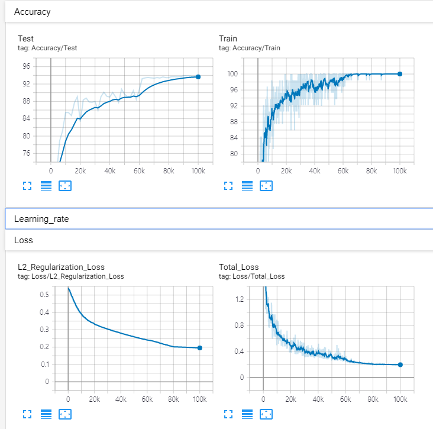
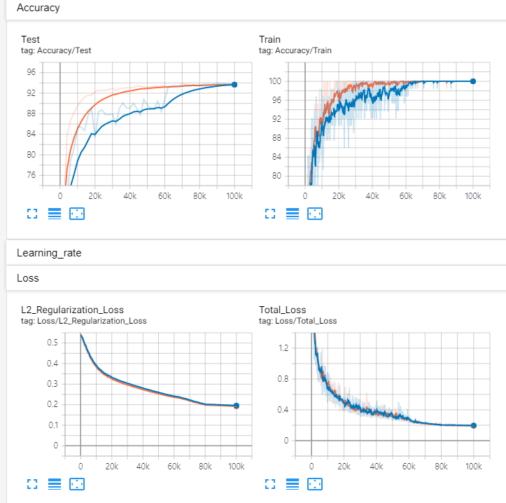

# Exponential Moving Average (EMA)

## # Run
1. generate dataset
```sh
python ./dataset/Generate_Dataset.py
```

2. train (Base and EMA)
```sh
python Train_Base.py
python Train_with_EMA.py
```

3. run tensorboard
```sh
tensorboard --logdir logs
```

## # Result
- Loss is almost similar to Base and EMA.
- Accuracy is that EMA is more stable that Base. 

1. Base


2. EMA


3. Base + EMA


## # Reference
- https://medium.com/datadriveninvestor/exponentially-weighted-average-for-deep-neural-networks-39873b8230e9

